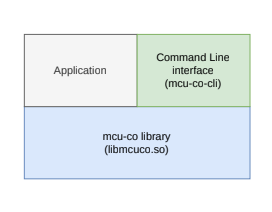

# mcu-co_sdk
## Overview
Reposity holding the source of Software Development Kit of the mcu-co project, this includes: shared library, command line interface and example programs using the library. mcu-co is a microcontroller used as a co-processor for a Linux host: it works as a GPIO expander, provides up to 12 PWM channels, and lets you bind input interrupts to GPIO outputs.



## Key Features

- **GPIO expander** – configure pins as inputs or outputs, then set, toggle or read them
  from the host.
- **12 PWM channels in 3 groups** – set a frequency per group and a duty cycle per pin,
  in 0.1% steps, with active-high or active-low polarity. Read back the frequency the
  MCU actually achieved.
- **Interrupt-driven outputs** – arm an edge trigger (rising, falling or both) on an
  input pin and bind it to an output action (drive low, drive high or toggle). The
  binding runs entirely on the MCU, with no round trip to the host.
- **C shared library (`libmcuco.so`)** – a small, typed C11 API over the serial
  protocol. Every call returns a status code, and `mcuco_strerror()` turns it into
  a message.
- **Command-line tool (`mcu-co-cli`)** – every library operation from the shell, for
  bring-up and scripting.
- **Example programs** – `blink`, `pwm_frequency`, `pwm_breathe` and `irq_bind`.
- **Any Linux host** – talks to the MCU through the kernel's standard serial
  devices (USB or on-board UART) with no extra drivers, and cross-compiles with any
  CMake toolchain file.

## Usage

```c
#include <mcuco.h>

mcuco_t *mcu = mcuco_open("/dev/ttyACM0", MCUCO_TIMEOUT_DEFAULT_MS);
if (mcu == NULL)
{
    perror("mcuco_open");
    return 1;
}

mcu_status_t status = mcuco_gpio_cfg(mcu, DIR_OUTPUT, PORT_A, 5);
if (status == MCUCO_STATUS_OK)
{
    status = mcuco_gpio_set(mcu, LEVEL_HIGH, PORT_A, 5);
}

if (status != MCUCO_STATUS_OK)
{
    fprintf(stderr, "%s\n", mcuco_strerror(status));
}

mcuco_close(mcu);
```

Every call returns an `mcu_status_t`, and `mcuco_strerror()` turns it into a
message. Full programs are in [examples/](examples/):

| Example | Shows |
|---|---|
| `blink.c` | Configuring a pin as an output and driving it high and low |
| `pwm_frequency.c` | Requesting PWM group frequencies and reading back what the MCU achieved |
| `pwm_breathe.c` | Fading an LED by ramping a PWM channel's duty cycle |
| `irq_bind.c` | Binding an input pin's interrupt to toggle an output, handled entirely on the MCU |

## Building

### Requirements

- CMake 3.22 or newer
- A C11 compiler (`gcc`) and a C++ compiler (`g++`), which the unit tests need
- `git` and network access on the first configure, which downloads CppUTest v4.0

### Native build

Run from the repository root to configure build directory.

```sh
cmake -S . -B build
```

Then build. The first command below builds everything: the library, the CLI, the
examples and the unit tests. To build only one of them, add `--target` and its name,
as the other commands show.

```sh
cmake --build build                       # everything
cmake --build build --target mcuco        # shared library -> build/library/libmcuco.so
cmake --build build --target mcu-co-cli   # CLI            -> build/cli/mcu-co-cli
cmake --build build --target blink        # an example     -> build/examples/blink
```

The other examples are `pwm_frequency`, `irq_bind` and `pwm_breathe`.
`cmake --build build --target help` lists every target.

Run the unit tests:

```sh
ctest --test-dir build --verbose
```

Remove the build:

```sh
rm -rf build
```

### Cross-compilation

Pass a CMake toolchain file when configuring. Use a separate build directory per
toolchain: once a directory is configured, CMake ignores a different `--toolchain`.

```sh
cmake -S . -B build-cross --toolchain <path/to/toolchain.cmake> # Set up
cmake --build build-cross # build all
```

This builds the library, the CLI and the examples for the target. The unit tests
are skipped, since they have to run on the build machine.

The toolchain file can live anywhere. Two examples ship in `cmake/` for the Ubuntu
cross compiler packages:

| Target | Toolchain file | Install the compiler |
|---|---|---|
| 64-bit ARM Linux | `cmake/toolchain-aarch64-linux-gnu.cmake` | `sudo apt install gcc-aarch64-linux-gnu g++-aarch64-linux-gnu` |
| 32-bit ARM Linux | `cmake/toolchain-arm-linux-gnueabihf.cmake` | `sudo apt install gcc-arm-linux-gnueabihf g++-arm-linux-gnueabihf` |

For example:

```sh
cmake -S . -B build-aarch64 --toolchain cmake/toolchain-aarch64-linux-gnu.cmake
cmake --build build-aarch64 # build all
```

To build one target, name it as in the native build:

```sh
cmake --build build-aarch64 --target mcuco        # shared library -> build-aarch64/library/libmcuco.so
cmake --build build-aarch64 --target mcu-co-cli   # CLI            -> build-aarch64/cli/mcu-co-cli
cmake --build build-aarch64 --target blink        # an example     -> build-aarch64/examples/blink
```

`unit_tests` is not a target in a cross build.

